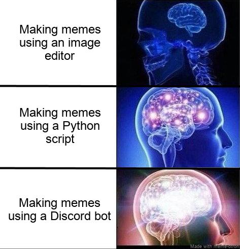

[](https://lgtm.com/projects/g/Klemek/meme-otron/alerts/)
[](https://lgtm.com/projects/g/Klemek/meme-otron/context:python)
[](https://coveralls.io/github/Klemek/meme-otron?branch=master)

# Meme-Otron

*When making a meme need to be instantaneous*

This is a Python module (and a discord bot) to make memes from templates, like this:  



> ```bash
> python3 -m meme_otron brain3 \
> "Making memes using an image editor" \
> "Making memes using a Python script" \
> "Making memes using a Discord bot" > main.jpg
> ```

## Installation

```bash
git clone https://github.com/Klemek/meme-otron
cd meme-otron
pip install -r requirements.txt
```

You're good to go

## Quick start

```bash
python -m meme_otron [meme_id] "text 1" "text 2" ... > output.jpg
```

## More info

The full documentation can be found [here](./docs/README.md).

It includes:
* Arguments syntax
* Discord help
* CLI help
* Full list of templates with images

## Discord bot

You can invite the bot on your server with [this link](https://discordapp.com/api/oauth2/authorize?client_id=704073533776723988&permissions=43072&scope=bot).

## History

* 1.3
  * **Complex memes syntax**
  * Examples in docs
  * "Reaction" templates
  * Reworked CLI arguments
  * More unit testing
  * More docs
  * Bug fix
* 1.2
  * Reworked text fitting
  * Unit testing
  * More docs
  * Bug fix
* 1.1
  * More docs
  * Bug fix
    * Empty string fix
* 1.0
  * Initial release
   